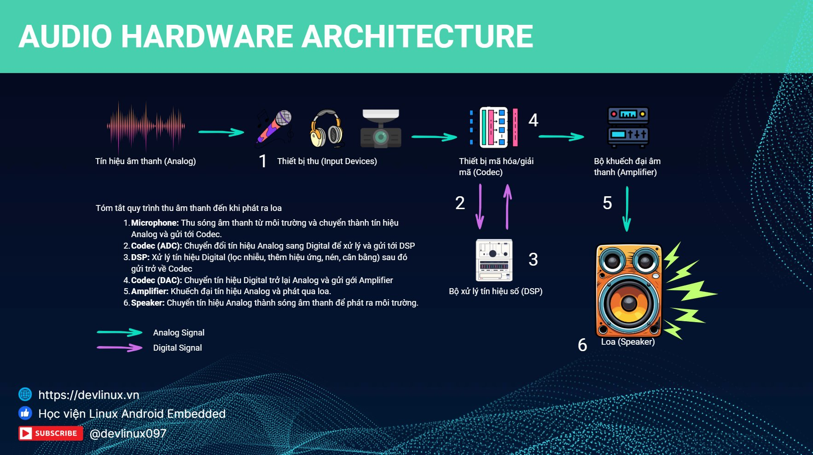
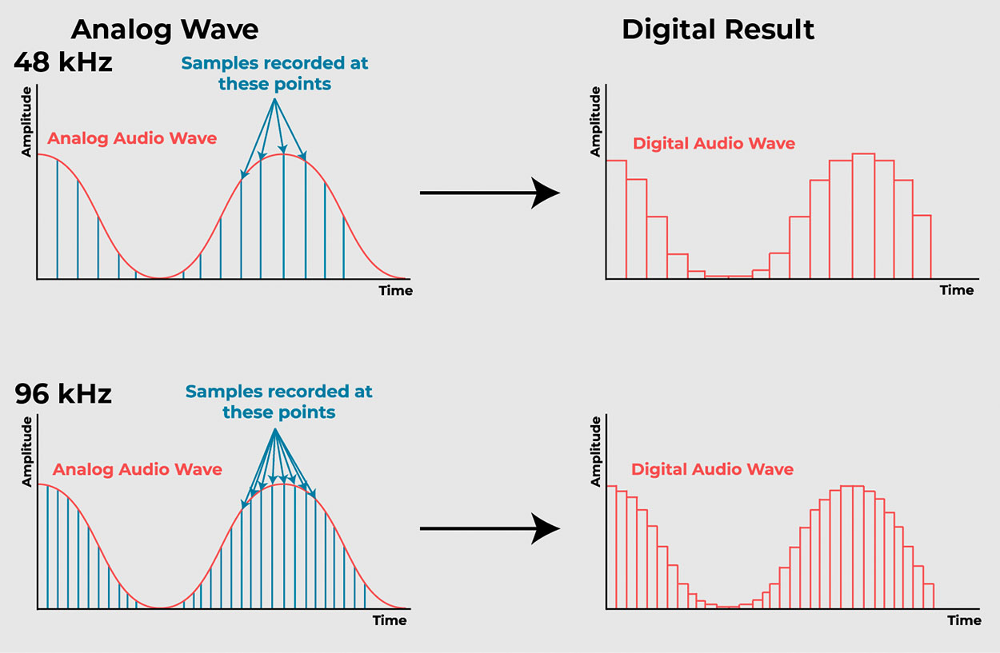
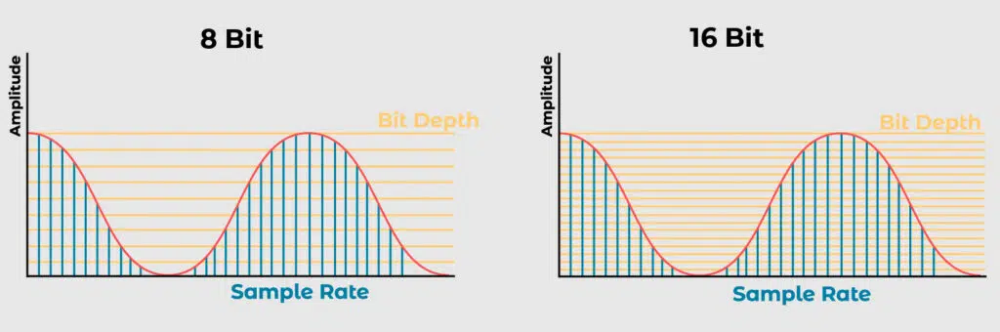

# AUDIO HARDWARE ARCHITECTURE

## Giới thiệu

Âm thanh là một trong những phương tiện giao tiếp tự nhiên và quan trọng nhất đối với con người. Trong các hệ thống điện tử hiện đại – đặc biệt là thiết bị nhúng như smartphone, hệ thống giải trí trên ô tô, loa thông minh hay thiết bị IoT – việc thu, xử lý và phát âm thanh số đã trở thành một chức năng không thể thiếu.

Tuy nhiên, đằng sau khả năng giao tiếp âm thanh tưởng chừng đơn giản ấy là một chuỗi các khối phần cứng được thiết kế công phu và tối ưu hóa cao độ. Từ microphone để thu sóng âm, mạch khuếch đại và lọc nhiễu, chuyển đổi tương tự–số (ADC), xử lý tín hiệu số (DSP), chuyển đổi số–tương tự (DAC), khuếch đại công suất (PA) cho đến loa phát, mỗi thành phần đều đảm nhiệm một vai trò then chốt và cần phối hợp chặt chẽ theo thời gian thực.

Báo cáo này sẽ tập trung phân tích chi tiết từng khối phần cứng cấu thành nên hệ thống âm thanh nhúng hiện đại, từ nguyên lý hoạt động, vai trò, mối quan hệ giữa các thành phần, cho đến các kỹ thuật và chuẩn giao tiếp điển hình trong hệ thống âm thanh điện tử.

## 1.1 🎤 Microphone – Cảm biến đầu vào của hệ thống âm thanh

### A. 📌 Tại sao cần microphone?

Microphone là thành phần **đầu tiên** trong chuỗi xử lý âm thanh nhúng. Vai trò của nó là **chuyển đổi dao động áp suất của sóng âm trong không khí thành tín hiệu điện** – dạng mà các mạch điện tử và bộ xử lý tín hiệu số (DSP) có thể hiểu và xử lý. 

Sóng âm là một hiện tượng vật lý, không thể xử lý trực tiếp bởi các mạch logic hoặc hệ điều hành. Nhờ microphone, âm thanh trong môi trường thật có thể được:
- Khuếch đại và tinh chỉnh (qua preamp, EQ)
- Số hóa (qua ADC)
- Xử lý, mã hóa, truyền đi hoặc phát lại

Microphone là thành phần không thể thiếu trong các hệ thống:
- Giao tiếp bằng giọng nói (voice assistant, smart speaker)
- Đàm thoại (VoIP, smartphone)
- Ghi âm, thu podcast
- Thiết bị IoT và wearable có điều khiển bằng giọng nói

---

### B. 🌊 Nguyên lý vật lý – Sóng âm là gì?

- **Sóng âm** là dao động áp suất lan truyền trong môi trường khí, lỏng, hoặc rắn.
- Các đặc trưng cơ bản:
  - **Biên độ (Amplitude):** đại diện cho độ lớn của âm thanh (cường độ)
  - **Tần số (Frequency):** số dao động mỗi giây (Hz), tai người nghe được từ 20 Hz – 20 kHz

---

### C. 🧠 Nguyên lý hoạt động theo từng loại microphone

| Loại Micro       | Nguyên lý hoạt động | Nguồn nuôi | Đặc điểm kỹ thuật nổi bật |
|------------------|---------------------|-------------|----------------------------|
| **Condenser**    | Diaphragm và backplate tạo tụ điện. Khi diaphragm rung, điện dung thay đổi → sinh ra điện áp. | Yêu cầu phantom power 48V | - Độ nhạy cao - Dải tần rộng - Self-noise thấp - Dùng trong studio, smartphone cao cấp |
| **Dynamic**      | Diaphragm gắn cuộn dây nằm trong từ trường. Dao động tạo dòng điện cảm ứng (Faraday). | Không cần nguồn ngoài | - Rất bền - Chịu áp âm cao - Độ nhạy thấp - Dùng trong sân khấu, loa phóng thanh |
| **MEMS**         | Diaphragm silicon siêu nhỏ. Dao động → biến thiên điện dung hoặc hiệu ứng áp điện. | 1.8–3.3V | - Kích thước nhỏ - Tích hợp sẵn preamp - Xuất analog hoặc digital (PDM/I²S) - Dùng trong smartphone, TWS, wearable |

---

### D. 🔌 Output của microphone

| Loại Micro        | Tín hiệu đầu ra      | Dạng tín hiệu         |
|-------------------|----------------------|------------------------|
| Condenser         | 0.01–1 V              | Analog (XLR/TRS)       |
| Dynamic           | 1–10 mV               | Analog (XLR/TRS)       |
| MEMS (Analog)     | 0.2–1 V               | Analog (pad trên PCB)  |
| MEMS (Digital)    | PDM hoặc I²S          | Digital (logic-level)  |

✅ Trong các hệ thống nhúng hiện đại, **MEMS microphone** là lựa chọn phổ biến nhờ:
- Kích thước nhỏ gọn, dễ tích hợp vào PCB
- Có thể xuất ra tín hiệu digital → bỏ qua ADC
- Tiêu thụ điện năng thấp, phù hợp cho thiết bị di động

---
## 1.2 🔊 Pre-Amplifier và Anti-Alias Filter – Khuếch đại và làm sạch tín hiệu trước ADC

Sau khi micro tạo ra tín hiệu điện áp analog, tín hiệu này thường rất yếu (1–10 mV), dễ bị nhiễu và **không đủ mạnh** để đưa vào bộ chuyển đổi ADC. Do đó, hệ thống audio cần bổ sung hai khối chức năng ngay sau microphone:

1. **Pre-amplifier (Tiền khuếch đại):** tăng cường biên độ tín hiệu để phù hợp ADC  
2. **Anti-alias filter (Bộ lọc chống aliasing):** loại bỏ thành phần tần số cao gây méo dạng khi số hóa

---

### A. 🎚️ Pre-Amplifier – Tăng cường tín hiệu đầu ra từ micro

#### 📌 Vai trò
- Khuếch đại tín hiệu yếu (mV) từ microphone → lên mức chuẩn cho ADC (500 mV – 1.5 V)
- **Cải thiện SNR**: làm tín hiệu nổi bật hơn so với nhiễu nền
- Tránh mất chi tiết âm thanh do độ phân giải thấp tại đầu vào ADC

#### ⚙️ Cách thức hoạt động

| Loại micro                  | Cấu trúc preamp                                 | Ghi chú kỹ thuật                                               |
|----------------------------|--------------------------------------------------|-----------------------------------------------------------------|
| **Electret & MEMS (Analog)** | Tích hợp sẵn **FET preamp** trong chip           | Output vài trăm mV, đủ mạnh để đưa vào ADC                     |
| **Dynamic / Electret rời**  | Yêu cầu preamp rời (JFET, op-amp...)             | Output chỉ vài mV → cần khuếch đại ngoài trước khi số hóa      |

#### 🧱 Mạch preamp rời (discrete / module)

| Giải pháp        | Ưu điểm                                  | Nhược điểm                                   |
|------------------|-------------------------------------------|----------------------------------------------|
| **MAX9814**      | AGC tích hợp, lọc và gain tự động          | Không chỉnh gain thủ công, tiêu thụ ~3mA     |
| **FetHead**      | Ultra-low noise, inline đơn giản           | Không tùy chỉnh tần số, không có filter nội  |
| **Op-Amp discrete** | Dễ tùy biến, kiểm soát gain và filter tốt | Phức tạp, cần thiết kế mạch riêng            |

---

### B. 🔇 Anti-Alias Filter – Bộ lọc tần số cao để tránh sai số khi số hóa

#### 📌 Vai trò
- Khi ADC lấy mẫu, nếu tồn tại thành phần tần số > **Nyquist** (Fs/2), nó sẽ bị **"gập ngược" (aliasing)** về dải thấp gây méo âm
- **Anti-aliasing filter** là một bộ **lọc thông thấp (Low-Pass Filter)** được đặt ngay trước ADC để loại bỏ nhiễu tần cao

#### ⚙️ Cách thức hoạt động

- **Tần số cắt (cutoff)** của filter thường thiết kế **ngay dưới Fs/2**  
  Ví dụ:
  - ADC sampling 48 kHz → filter cutoff ≈ 22–24 kHz
  - Dải nghe của con người kết thúc ở ~20 kHz → không ảnh hưởng âm thanh gốc

- Cấu hình mạch thường:
  - **RC / LC passives**
  - **Active filter (op-amp)** cho đáp ứng tốt hơn

---

### C. 📦 Tổng quan khối Preamp & Filter trong hệ thống thực tế

| Khối chức năng     | MEMS Analog Mic | MEMS Digital Mic (PDM) | Codec/SoC ADC | Module rời (DIY)     |
|--------------------|------------------|--------------------------|----------------|-----------------------|
| **Preamp**         | ✅ (FET on-chip) | ❌ (PDM là digital)       | —              | MAX9814, FetHead, JFET |
| **Anti-alias Filter** | 🔁 Tuỳ codec     | ❌ Không cần (dùng DSP)    | ✅ Tích hợp hoặc ngoài | RC, LC, op-amp LPF     |

#### 🧠 Ghi chú:
- **MEMS Digital (PDM)**: không cần preamp hay filter → tín hiệu đã số hóa → chuyển đổi PDM→PCM bằng DSP
- **Electret & Dynamic**: luôn cần **preamp ngoài**, filter thường nằm ở đầu vào ADC hoặc trong codec

---
## 2. 🔄 ADC – Chuyển đổi Analog → Digital

**Analog-to-Digital Converter (ADC)** là module có nhiệm vụ **chuyển tín hiệu analog liên tục (dạng sóng điện áp)** thành **chuỗi số rời rạc (PCM)**. Đây là bước bắt buộc trước khi đưa tín hiệu vào xử lý bằng vi điều khiển, SoC, hoặc DSP.

---

### A. ⚙️ Cách thức hoạt động – 2 bước chính

#### A.1. 🕒 Sample Rate – Lấy mẫu theo thời gian

Sample Rate: (Sampling Rate, Sampling Frequency): Là số lần lấy mẫu trên một giây, có đơn vị Hz. Một bản nhạc có sample rate là 44100 Hz thì mỗi giây nhạc sẽ được lấy mẫu 44100 lần.

✅ Theo **định lý Nyquist**:  
- Tất cả thông tin của tín hiệu gốc có thể được phục hồi nếu nó được lấy mẫu với tần số (Fs) lớn gấp ít nhất 2 lần tần số cao nhất của tín hiệu gốc
- Tai người có khả năng nghe trong khoảng 20Hz – 20kHz, vì vậy sample rate tối thiểu cần thiết là 40kHz. Do đó, chuẩn 44.1kHz của CD là đủ để tái tạo toàn bộ dải âm thanh mà con người có thể nghe.

**Giá trị mẫu phổ biến của Fs:**
- 8 kHz → điện thoại (telephone)
- 44.1 kHz → nhạc số CD
- 48 kHz, 96 kHz, 192 kHz → hệ thống chuyên nghiệp, studio

---

#### A.2. 📐 Quantization – Lượng tử hóa biên độ

- Để lưu lại dưới dạng số, mỗi mẫu được biểu diễn bằng một lượng bit dữ liệu nhất định, gọi là **BitDepth**. Các bản nhạc hiện nay thường có BitDepth là 16 bits, 24 bits…BitDepth càng lớn âm thanh càng sắc nét, trung thực nên nó còn được gọi là **Resolution** (độ nét).

**BitDepth phổ biến:**
- 16-bit → dùng trong CD Audio
- 24-bit → chuyên nghiệp / studio
- 32-bit → floating-point, dynamic range cực cao

**Tác động:**
- **BitDepth** càng cao → tín hiệu càng chi tiết → **ít nhiễu lượng tử**, **dải động (dynamic range)** rộng hơn

---

### B. 🔌 Đầu vào / đầu ra của ADC

#### B.1. 📥 Đầu vào (Input)

- **Tín hiệu analog đã được xử lý trước đó**:
  - Đã **khuếch đại bởi Preamp**
  - Đã **lọc anti-alias**
- Loại tín hiệu:
  - **Single-ended** (chuẩn phổ thông)
  - **Differential** (nhiễu thấp hơn)
- Dải điện áp đầu vào:
  - ±Vref hoặc 0 → Vref
  - Vref = 1.8V, 2.5V, 3.3V tùy IC

---

#### B.2. 📤 Đầu ra (Output)

- Chuỗi số theo chuẩn **PCM – Pulse-Code Modulation**
- Dữ liệu có thể gồm:
  - Mono (1 kênh)
  - Stereo (2 kênh)
  - N kênh (multi-channel: 4, 6, 8…)

- PCM có thể truyền qua các giao tiếp số như:
  - I²S (Inter-IC Sound)
  - TDM (Time-Division Multiplexing)

---

#### B.3. Công thức tính kích thước frame
**Công thức:**

\[
\text{Size (bytes)} = \text{Thời gian (s)} \times \text{Sample Rate (Hz)} \times \text{Bit Depth (bytes)} \times \text{Số kênh}
\]

**Trong đó:**
- **Sample Rate **= số mẫu/giây
- **Bit Depth **(bytes) = số byte mỗi mẫu (VD: 16 bits = 2 bytes)
- Số kênh = 1 (mono), 2 (stereo), ...

Ví dụ: một phút của bản ghi âm có : Sample rate = 44100 Hz, BitDepth = 16 bits = 2 bytes, Channel = 1 kênh sẽ có dung lượng: 44100 đợt lấy mẫu x 2 bytes x 60 giây x 1 kênh = 5.297.000 bytes, tức khoảng 5.3 MB

- **BitRate**: Là thông số thu gọn, đại diện cơ bản cho các thuộc tính trên. Bitrate có đơn vị Kbps (Kilobits per second) – dung lượng (tính theo bit) của âm thanh số trên một giây. Với Bitrate, ta có thể xác định nhanh chóng dung lượng cũng như phần nào chất lượng của bản nhạc.

## 3. 🎛️ DSP – Bộ xử lý tín hiệu số

Sau khi tín hiệu analog đã được chuyển đổi thành dạng số (PCM), **DSP (Digital Signal Processor)** đóng vai trò trung tâm trong việc **xử lý, tinh chỉnh và tối ưu hóa âm thanh** dựa trên ứng dụng, môi trường, và chất lượng mong muốn.

---

### A. Input / Output của DSP

| Thành phần             | Dữ liệu                                               |
| ---------------------- | ----------------------------------------------------- |
| **Đầu vào** (Input)    | Chuỗi PCM frame từ ADC, truyền qua bus I²S/TDM        |
| **Xử lý** (Processing) | Áp dụng các thuật toán xử lý âm thanh số              |
| **Đầu ra** (Output)    | PCM đã xử lý → đưa sang DAC, lưu trữ hoặc truyền tiếp |

---

### B. Vai trò và nguyên lý hoạt động của từng khối xử lý trong DSP

#### B.1. Noise Filtering – Lọc nhiễu nền

* **Mục đích:** loại bỏ hiss, hum (50/60Hz), rumble để cải thiện độ rõ của giọng và nhạc.
* **Phương pháp:** FIR (linear phase), IIR (độ trễ thấp)
* **Hậu quả nếu thiếu:** âm nền ồn ào, che giọng nói, gây mệt khi nghe lâu.

#### B.2. Acoustic Echo Cancellation (AEC) – Triệt tiếng vọng

* **Mục đích:** loại bỏ tiếng từ loa bị mic ghi lại.
* **Phương pháp:** Adaptive Filter (LMS, NLMS, RLS), double-talk detection
* **Hậu quả nếu thiếu:** phản hồi, hú mic, khó hiểu trong cuộc gọi.

#### B.3. Active Noise Cancellation (ANC) – Khử ồn chủ động

* **Mục đích:** tạo sóng ngược pha triệt nhiễu môi trường.
* **Phương pháp:** Feedforward/Feedback microphones
* **Hậu quả nếu thiếu:** nhiễu môi trường làm giảm chất lượng nghe.

#### B.4. Equalizer (EQ) – Cân bằng âm sắc

* **Mục đích:** điều chỉnh dải tần (bass/mid/treble) theo nội dung hoặc sở thích.
* **Phương pháp:** Parametric EQ, Graphic EQ, Shelving filter
* **Hậu quả nếu thiếu:** âm thiếu cân bằng, thiếu màu sắc.

#### B.5. Dynamic Range Compression (DRC) / Automatic Gain Control (AGC)

* **Mục đích:** giảm chênh lệch giữa âm lớn – nhỏ.
* **Phương pháp:** Compressor (threshold, ratio), Limiter, Expander
* **Hậu quả nếu thiếu:** âm thanh không ổn định, dễ clip hoặc quá nhỏ.

#### B.6. Sample Rate Conversion (SRC)

* **Mục đích:** đồng bộ mẫu giữa ADC/DAC, USB, Bluetooth…
* **Phương pháp:** CIC Filter, Polyphase filter bank
* **Hậu quả nếu thiếu:** lệch tốc độ, aliasing, giật tiếng.

#### B.7. Dither & Noise Shaping

* **Mục đích:** giảm méo khi giảm bit-depth.
* **Phương pháp:** thêm nhiễu nhỏ (dither), noise shaping
* **Hậu quả nếu thiếu:** âm "hạt", thô, mất chi tiết nhỏ.

#### B.8. Mixer & Channel Matrix

* **Mục đích:** trộn hoặc phân kênh tín hiệu (mono/stereo/5.1…)
* **Phương pháp:** Gain matrix, interleaving/de-interleaving
* **Hậu quả nếu thiếu:** không đa kênh, mất âm trường.

#### B.9. Spatial Audio / Virtualization

* **Mục đích:** tạo trải nghiệm âm thanh không gian (3D).
* **Phương pháp:** HRTF, Binaural, Ambisonics
* **Hậu quả nếu thiếu:** âm thanh phẳng, thiếu định hướng.

#### B.10. Codec & Packetizer

* **Mục đích:** nén PCM và đóng gói theo giao thức.
* **Phương pháp:** MP3, AAC, Opus codec; RTP, ADPCM packetizer
* **Hậu quả nếu thiếu:** tốn băng thông, không tương thích stream.

#### B.11. Metering & Loudness Normalization

* **Mục đích:** chuẩn hóa âm lượng theo LUFS/RMS/Peak.
* **Phương pháp:** đo mức tích lũy/ngắn hạn, ReplayGain
* **Hậu quả nếu thiếu:** âm lượng không đồng đều giữa nội dung.

#### B.12. Voice Front-end (ASR prep)

* **Mục đích:** chuẩn bị tín hiệu cho nhận diện giọng nói.
* **Phương pháp:** VAD, MFCC, keyword spotting
* **Hậu quả nếu thiếu:** ASR kém chính xác, chậm, tiêu hao tài nguyên.

---

## 4. 🔁 DAC – Chuyển đổi Digital → Analog

Sau khi tín hiệu số PCM đã được xử lý bởi DSP, **Digital-to-Analog Converter (DAC)** là thành phần chịu trách nhiệm chuyển đổi chuỗi dữ liệu số này thành **tín hiệu điện áp analog liên tục**, để truyền sang ampli và loa – những thiết bị chỉ hiểu tín hiệu dạng sóng.

---

### A. 🎯 Vai trò và Tầm quan trọng của DAC

| Thành phần | Input (Dữ liệu vào)                              | Output (Dữ liệu ra)          |
| ---------- | ------------------------------------------------ | ---------------------------- |
| **DAC**    | PCM frame – 16/24/32-bit, đều đặn theo thời gian | Sóng điện áp analog liên tục |

* **Loa và ampli không thể xử lý dữ liệu số**, vì thế dữ liệu số phải được chuyển lại thành tín hiệu điện áp biến thiên – đại diện cho âm thanh.
* DAC càng chính xác, âm thanh càng tự nhiên, mượt mà và dễ nghe.

---

### B. ⚙️ Nguyên lý hoạt động chính của DAC

---

#### B.1 ⏫ Oversampling – Lấy mẫu vượt tần số gốc

* **Mục tiêu:** Thay vì xuất tín hiệu tại đúng tần số lấy mẫu gốc Fs (ví dụ 48 kHz), DAC hoạt động ở tần số cao hơn: `Fs_osr = OSR × Fs` (với OSR từ 4 đến 64).

* **Lý do:**

  * Đẩy nhiễu lượng tử (quantization noise) ra khỏi dải nghe được.
  * Cho phép dùng bộ lọc tái tạo đơn giản hơn (dốc thấp).

* **Nếu không oversample:**

  * Nhiễu rải đều, gây tiếng **hiss** khó chịu.
  * Cần filter analog gắt → gây trễ pha và méo âm.

---

#### B.2 🧮 Interpolation – Nội suy số

* **Mục tiêu:** Tạo thêm các mẫu trung gian giữa 2 điểm PCM gốc để làm mượt sóng số.

* **Phương pháp:** Áp dụng bộ lọc nội suy số FIR/IIR để chèn thêm điểm trung gian. VD: 0.5 V → 1.0 V → chèn 7 điểm giả lập (với OSR = 8).

* **Lợi ích:**

  * Làm mượt tín hiệu trước khi chuyển đổi.
  * Giảm bậc thang, tránh gây méo hài.

* **Nếu không nội suy:**

  * Tín hiệu analog có dạng bậc thang, gây ra méo và khó chịu khi nghe.

---

#### B.3 🧯 Reconstruction Filter – Bộ lọc tái tạo (Low-pass Filter)

* **Mục tiêu:** Sau khi nội suy, vẫn tồn tại các thành phần tần số cao nằm ngoài dải nghe được. Cần lọc để tránh aliasing.

* **Thiết kế:**

  * **Passive:** RC, LC filter đơn giản.
  * **Active:** Butterworth (đáp tuyến dốc), Bessel (pha tuyến tính).

* **Lý do:**

  * Loại bỏ các tín hiệu vượt quá Fs/2.
  * Giữ lại dải tần quan trọng 20 Hz – 20 kHz.

* **Nếu không lọc:**

  * Xuất hiện méo, tiếng hú, vỡ tiếng.
  * Có thể gây hư hỏng loa do thành phần cao tần dư.

---

## 5. 🔊 Power Amplifier → Speaker (Analog)

Sau khi DAC tạo ra tín hiệu analog ở mức "line-level" (thường vài trăm mV), khối **Power Amplifier (PA)** có nhiệm vụ khuếch đại công suất đủ lớn để **drive loa**. Cuối cùng, **loa (speaker)** biến tín hiệu điện thành dao động cơ học trong không khí – tái tạo lại âm thanh mà tai người nghe được.

---

### A. 🔋 Power Amplifier – Khuếch đại công suất

#### A.1 Chức năng chính

* Tăng điện áp/tín hiệu analog lên mức **cao về điện áp hoặc dòng** để đủ sức đánh loa (thường trở kháng 4–8 Ω).
* Chuyển tín hiệu mức thấp → công suất vài W đến hàng chục W.

#### A.2 Phân loại theo kiến trúc khuếch đại

* **Class D**

  * Dùng PWM hoặc Sigma-Delta modulation
  * Hiệu suất cao ≥ 90%, ít tỏa nhiệt
  * Cần **bộ lọc LC đầu ra** để triệt PWM và EMI

* **Class AB**

  * Kết hợp tuyến tính Class A và hiệu quả Class B
  * Hiệu suất trung bình (\~60%), âm thanh ấm áp

* **Class A / G / H / E**

  * Class A: tuyến tính tốt nhất, méo thấp nhất nhưng hiệu suất kém (≤ 25%)

#### A.3 Các thông số kỹ thuật quan trọng

* **Gain (dB)** – độ khuếch đại
* **THD+N (%)** – độ méo tổng và nhiễu
* **Efficiency (%)** – hiệu suất công suất
* **Slew Rate (V/µs)** – tốc độ đáp ứng với tín hiệu nhanh
* **EMI Filter** – lọc nhiễu đầu ra tránh ảnh hưởng mạch khác

---

### B. 🔈 Speaker – Biến điện thành âm thanh

#### B.1 Nguyên lý hoạt động

* Loa động (dynamic driver): cuộn dây đặt trong từ trường di chuyển theo tín hiệu → làm màng loa dao động → phát sóng âm

#### B.2 Các thông số quan trọng

* **Fs (Hz):** tần số cộng hưởng → ảnh hưởng response dải thấp
* **Xmax (mm):** biên độ tối đa mà màng loa có thể di chuyển
* **Sensitivity (dB SPL):** độ nhạy (thường đo tại 1 W/1 m)
* **Impedance (Ω):** thường là 4 Ω hoặc 8 Ω
* **Power Rating (W):** công suất liên tục chịu được

#### B.3 Phân loại loa

* **Full-range:** một driver phát toàn dải tần
* **2-way / 3-way:** chia tần số qua crossover

  * Tweeter (cao), Midrange (trung), Woofer (trầm)

---

## Kết luận

Một hệ thống âm thanh số là sự tích hợp của nhiều khối phần cứng, mỗi khối đảm nhiệm một nhiệm vụ độc lập nhưng liên kết chặt chẽ với nhau để tạo nên trải nghiệm âm thanh chính xác và sống động. Chuỗi xử lý này bao gồm:

**Microphone (Pre-amp & Anti-alias Filter) → ADC → DSP → DAC → Power Amplifier → Speaker**

Từ việc chuyển đổi tín hiệu vật lý (sóng âm) thành điện, sau đó thành dữ liệu số để xử lý, rồi quay trở lại tín hiệu analog và tái tạo âm thanh – toàn bộ quá trình đòi hỏi độ chính xác, độ trễ thấp và chất lượng cao ở mọi khâu.

Việc hiểu rõ từng thành phần phần cứng không chỉ giúp ta thiết kế hoặc lựa chọn giải pháp âm thanh phù hợp, mà còn là nền tảng để tối ưu hiệu năng, tiết kiệm năng lượng và nâng cao trải nghiệm người dùng trong các hệ thống nhúng ngày càng thông minh và phức tạp.