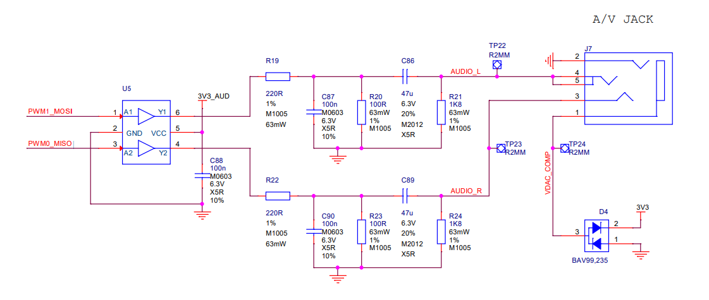

# Audio Hardware Raspberry pi 4


---

## Raspberry Pi 4B - Specifications

| Parameter         | Description |
|------------------|-------------|
| **Product Info**  | Raspberry Pi 4B<br>• [RPi4B Product Brief (PDF)](./raspberry-pi-4b-product-brief.pdf)  <br>• [RPi4B Datasheet (PDF)](./raspberry-pi-4b-datasheet.pdf) |
| **Processors**    | Broadcom BCM2711 SoC<br>• CPU: 1.5GHz 64-bit Quad-Core Cortex-A72 (ARM v8) SoC<br>• GPU: VideoCore VI @ 500MHz supporting OpenGL ES 3.0 graphics |
| **Memory**        | • 1GB, 2GB, 4GB or 8GB LPDDR4-3200 SDRAM on-die ECC (depending on model)<br>• microSD card slot for loading operating system and data storage |
| **USB**           | • 2x Type-A USB 3.0 ports<br>• 2x Type-A USB 2.0 ports |
| **Ethernet**      | 1x RJ45 Gigabit Ethernet port |
| **Wireless**      | • WiFi 2.4GHz and 5.0GHz IEEE 802.11ac<br>• Bluetooth 5.0 & BLE |
| **Video & Sound** | • 2x micro-HDMI ports<br>• 1x 2-lane MIPI DSI (15-pin, 1mm pitch)<br>• 1x 2-lane MIPI CSI-2 camera port (15-pin, 1mm pitch)<br>• 1x 4-pole 3.5mm stereo audio and composite video port |
| **Multimedia**    | • H.265 (4Kp60 decode)<br>• H.264 (1080p60 decode, 1080p30 encode)<br>• OpenGL ES 3.0 graphics |
| **GPIO**          | • Standard 40-pin GPIO header (fully backwards compatible)<br>• 2x 5V DC input/output power pins<br>• 2x 3.3V output power pins<br>• 8x GND pins<br>• 26x Digital I/O<br>• 4x PWM<br>• 1x UART<br>• 1x I2C<br>• 1x SPI<br>• 1x PCM (I2S)<br>• 1x I2C EEPROM<br>_Note: No analog inputs, use external ADC via I2C/SPI if needed_ |
| **Power**         | • 5V 3A DC via USB-C connector<br>• 5V 3A DC via GPIO header<br>• PoE enabled (requires separate PoE HAT)<br>_Note: A good quality 2.5A power supply can be used if USB peripherals consume less than 500mA total_ |
| **Operating Temp**| 0°C to +50°C (32°F to 122°F) |
| **Board Size**    | 85mm x 56mm x 19.5mm (3.35in x 2.21in x 0.77in) |

---

### Tải source Android kernel tại: [**Android Kernel Manifest for Raspberry Pi**](https://github.com/raspberry-vanilla/android_kernel_manifest)

---

## Device Tree PCM-I2S

- Sơ đồ liên kết:

```

&i2s (node I2S controller)
 ├── pinctrl-0 = <&i2s_pins>
 │    └── GPIO 18~21 ở ALT0 (PCM mode)
 ├── clocks = <&clocks BCM2835_CLOCK_PCM>
 └── compatible = "brcm,bcm2835-i2s" → Gắn với driver `bcm2835-i2s.c`

```

Các file liên quan đến pcm:

-`common/arch/arm/boot/dts/broadcom/bcm283x.dtsi`
```
i2s: i2s@7e203000 {
	compatible = "brcm,bcm2835-i2s";
	reg = <0x7e203000 0x24>;
	clocks = <&clocks BCM2835_CLOCK_PCM>;
	status = "disabled";
};
```

-`common/arch/arm/boot/dts/broadcom/bcm2835-common.dtsi`
```
&i2s {
	dmas = <&dma 2>, <&dma 3>;
	dma-names = "tx", "rx";
};
```

-`common/arch/arm/boot/dts/broadcom/bcm2711-rpi-4-b.dts`
```
&i2s {
	pinctrl-names = "default";
	pinctrl-0 = <&i2s_pins>;
};
```

-`common/arch/arm/boot/dts/broadcom/bcm2711-rpi-ds.dtsi`
```
i2s_pins: i2s {
	brcm,pins = <18 19 20 21>;
	brcm,function = <BCM2835_FSEL_ALT0>;
};
```
Hoặc khi chuyển từ `PCM mode` sang `GPIO mode` thì sử dụng file `common/arch/arm/boot/dts/overlays/i2s-gpio28-31-overlay.dts`

```
/*
 * Device tree overlay to move i2s to gpio 28 to 31 on CM
 */

/dts-v1/;
/plugin/;

/ {
	compatible = "brcm,bcm2835";

	fragment@0 {
		target = <&i2s_pins>;
		__overlay__ {
			brcm,pins = <28 29 30 31>;
			brcm,function = <6>; /* alt2 */
		};
	};
};
```

---
## Device Tree HDMI

Các file liên quan đến HDMI

-`common/arch/arm/boot/dts/broadcom/bcm2711.dtsi`
```
hdmi0: hdmi@7ef00700 {
			compatible = "brcm,bcm2711-hdmi0";
			reg = <0x7ef00700 0x300>,
			      <0x7ef00300 0x200>,
			      <0x7ef00f00 0x80>,
			      <0x7ef00f80 0x80>,
			      <0x7ef01b00 0x200>,
			      <0x7ef01f00 0x400>,
			      <0x7ef00200 0x80>,
			      <0x7ef04300 0x100>,
			      <0x7ef20000 0x100>;
			reg-names = "hdmi",
				    "dvp",
				    "phy",
				    "rm",
				    "packet",
				    "metadata",
				    "csc",
				    "cec",
				    "hd";
			clock-names = "hdmi", "bvb", "audio", "cec";
			resets = <&dvp 0>;
			interrupt-parent = <&aon_intr>;
			interrupts = <0>, <1>, <2>,
				     <3>, <4>, <5>;
			interrupt-names = "cec-tx", "cec-rx", "cec-low",
					  "wakeup", "hpd-connected", "hpd-removed";
			ddc = <&ddc0>;
			dmas = <&dma 10>;
			dma-names = "audio-rx";
			status = "disabled";
		};
```

-`common/arch/arm/boot/dts/broadcom/bcm2711-rpi.dtsi`
```
&hdmi0 {
	clocks = <&firmware_clocks 13>, <&firmware_clocks 14>, <&dvp 0>, <&clk_27MHz>;
	clock-names = "hdmi", "bvb", "audio", "cec";
	wifi-2.4ghz-coexistence;
};
```
-`common/arch/arm/boot/dts/broadcom/bcm2711-rpi-4-b.dts`
```
&hdmi0 {
	status = "okay";
};
...
/ {
	__overrides__ {
		audio = <&chosen>,"bootargs{on='snd_bcm2835.enable_headphones=1 snd_bcm2835.enable_hdmi=1',off='snd_bcm2835.enable_headphones=0 snd_bcm2835.enable_hdmi=0'}";
		...
	};
};
```

## Device Tree jack 3.5mm


- `PWM1_MOSI` và `PWM0_MISO` : tín hiệu PWM audio output từ SoC.
- `Low-pass filter` : convert PWM thành tín hiệu analog.
- `Jack 3.5mm` : chuẩn 4 pole GROUND, AUDIO_L, VDAC_COMP, AUDIO_R.
- `Test Point` : debug mạch.

---

- Cấu hình jack 3.5mm sẽ có trong file: common/arch/arm/boot/dts/broadcom/bcm2711-rpi-4-b.dts
  
```

&gpio {
	audio_pins: audio_pins {
		brcm,pins = <40 41>;
		brcm,function = <4>;
		brcm,pull = <0>;
	};
};
...
&vchiq {
	pinctrl-names = "default";
	pinctrl-0 = <&audio_pins>;
};
...
__overrides__ {
	audio = <&chosen>,"bootargs{on='snd_bcm2835.enable_headphones=1 snd_bcm2835.enable_hdmi=1',off='snd_bcm2835.enable_headphones=0 snd_bcm2835.enable_hdmi=0'}";
};

```

- Giải thích device tree:
- Khai báo `audio_pins` sử dụng GPIO40 và GPIO41.
- Gán `audio_pins` (GPIO40/41) cho node `vchiq` (VideoCore Host Interface Queue).
- Trường `overrides` với khóa `audio`: cho phép bật/tắt audio đầu ra:
  - Bật: `snd_bcm2835.enable_headphones=1 snd_bcm2835.enable_hdmi=1`
  - Tắt: `snd_bcm2835.enable_headphones=0 snd_bcm2835.enable_hdmi=0`
  - Cả hai đều được driver snd_bcm2835 (ALSA) trong kernel xử lý

- Vchiq sẽ được định nghĩa tại `common/arch/arm/boot/dts/broadcom/bcm2835-rpi.dtsi`. Ta lấy được thông tin trường `compatible`.

```
/ {
	soc {
		firmware: firmware {
			compatible = "raspberrypi,bcm2835-firmware", "simple-mfd";
			#address-cells = <1>;
			#size-cells = <1>;

			mboxes = <&mailbox>;
			dma-ranges;
		};

		power: power {
			compatible = "raspberrypi,bcm2835-power";
			firmware = <&firmware>;
			#power-domain-cells = <1>;
		};

		vchiq: mailbox@7e00b840 {
			compatible = "brcm,bcm2835-vchiq";
			reg = <0x7e00b840 0x3c>;
			interrupts = <0 2>;
		};
	};
};
```

## ALSA kernel in RPI4

Chúng ta sẽ tìm thấy kernel driver của Audio Raspery pi4 trong `common/drivers/staging/vc04_services/bcm2835-audio`

```
tiendq@tiendq-B760MX2-E-D4:~/aosp/rpi_kernel/common/drivers/staging/vc04_services/bcm2835-audio$ tree
.
├── bcm2835.c
├── bcm2835-ctl.c
├── bcm2835.h
├── bcm2835-pcm.c
├── bcm2835-vchiq.c
├── Kconfig
├── Makefile
└── vc_vchi_audioserv_defs.h
```

## Flow khởi tạo bcm2835 audio driver


## To be continue ...
