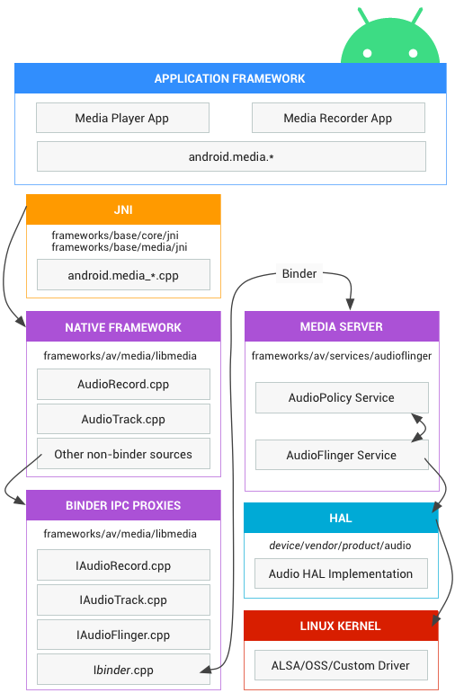

# 🎧 Tổng quan hệ thống audio trong Android

Hệ thống audio của Android được thiết kế theo kiến trúc phân tầng, giúp tách biệt rõ ràng giữa ứng dụng, xử lý logic, phần mềm trung gian và phần cứng. Từ ứng dụng (app) cho đến driver kernel, mỗi lớp đảm nhận một vai trò riêng và giao tiếp với nhau qua các giao diện chuẩn như HAL và Binder IPC.

Luồng xử lý âm thanh (audio path) có thể được mô tả như sau:

1. **Ứng dụng Android** gọi các API trong `android.media` để phát hoặc ghi âm.
2. Các lời gọi này được chuyển qua **JNI** để vào native code.
3. **Native framework** dùng các proxy thông qua **Binder IPC** để gọi xuống **Media Server**.
4. **Media Server** (AudioFlinger, AudioPolicy) xử lý logic âm thanh, mix stream, quản lý route và gọi xuống **Audio HAL**.
5. **Audio HAL** giao tiếp với driver thiết bị (ALSA, USB, I2S...) thông qua các giao diện chuẩn.
6. Cuối cùng, **driver kernel** tương tác với phần cứng để phát âm hoặc ghi âm.

## 📱 Application Framework

Lớp application framework bao gồm mã nguồn ứng dụng sử dụng API của `android.media` để tương tác với hệ thống audio. Nội bộ, các lời gọi này sẽ gọi đến các lớp glue JNI để truy cập code native xử lý audio.

## 🔸 JNI (Java Native Interface)

Lớp JNI tương ứng với `android.media` có nhiệm vụ gọi xuống native code cấp thấp để truy cập phần cứng audio. JNI nằm tại:

- `frameworks/base/core/jni/`
- `frameworks/base/media/jni/`

## ⚙️ Native Framework

Lớp native framework cung cấp phiên bản tương đương với `android.media` ở tầng C++, sử dụng các proxy qua Binder IPC để truy cập các dịch vụ audio của media server. Mã nguồn nằm tại:

- `frameworks/av/media/libmedia`

## 🔗 Binder IPC

Các proxy Binder IPC giúp giao tiếp qua ranh giới tiến trình (inter-process communication). Các class proxy này nằm trong `libmedia` và thường bắt đầu bằng chữ "I" (ví dụ: `IAudioFlinger`, `IAudioPolicyService`).

## 🧠 Media Server

Media server chứa các dịch vụ audio thực sự, là nơi xử lý logic và giao tiếp trực tiếp với HAL. Bao gồm:

- `AudioFlinger`: xử lý phát, mix, buffer
- `AudioPolicyService`: quyết định route, device, volume
Nằm tại:
- `frameworks/av/services/audioflinger`

## 🧩 HAL (Hardware Abstraction Layer)

HAL định nghĩa giao diện chuẩn mà media server gọi đến. Đây là nơi bạn cần hiện thực nếu muốn phần cứng audio hoạt động đúng. Chi tiết giao diện nằm trong các file `*.hal` tương ứng với version của Audio HAL.

## ⚙️ Kernel Driver

Driver audio trong kernel tương tác trực tiếp với phần cứng. Android hỗ trợ:

- **ALSA** (Advanced Linux Sound Architecture)
- **OSS** (Open Sound System)
- Hoặc driver tùy chỉnh (HAL không ràng buộc driver)

Driver có thể là:

- **Built-in** (`CONFIG_...=y`)
- **.ko module** (`/lib/modules/...`)
