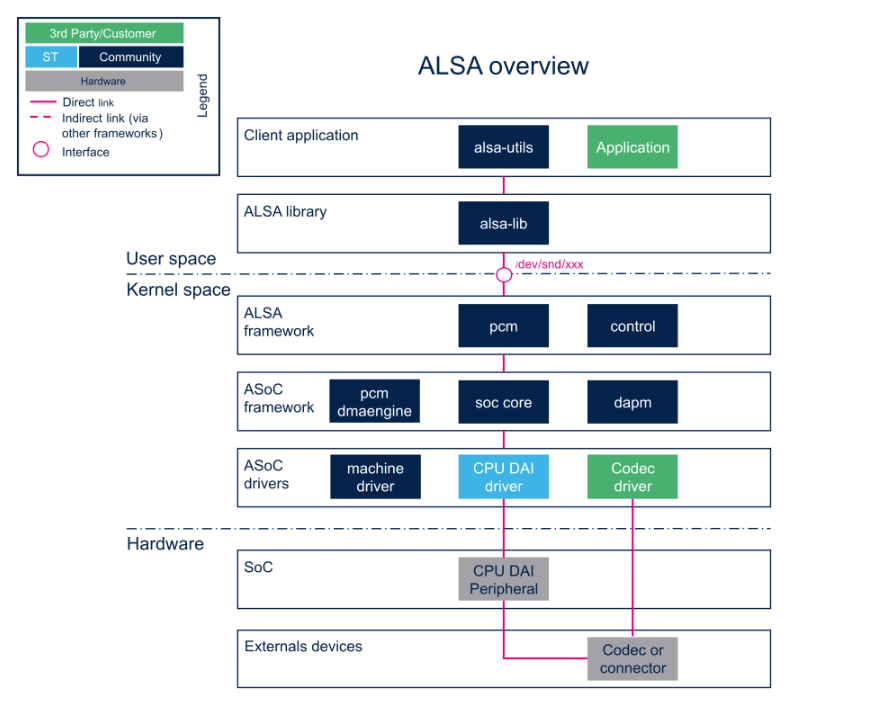
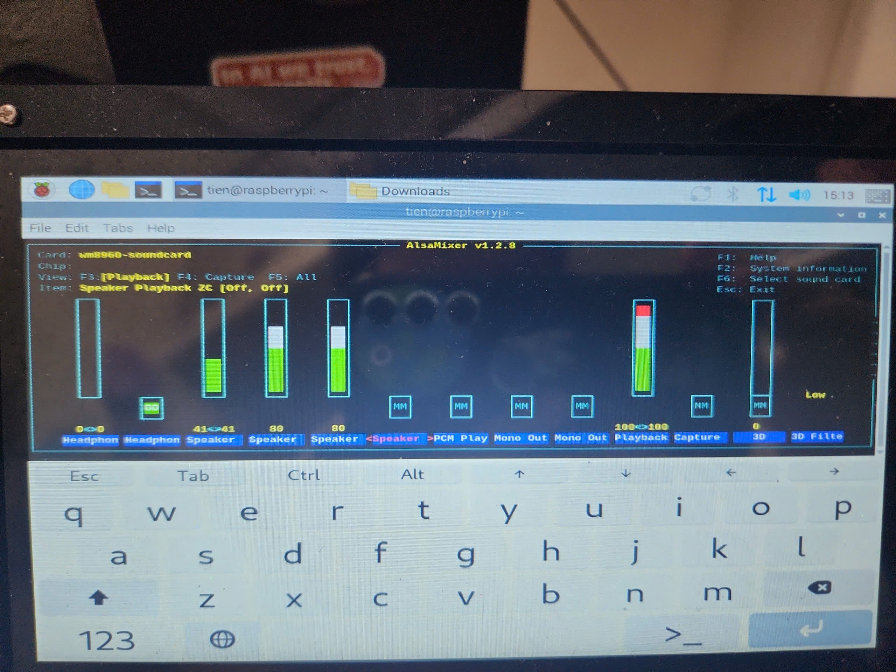

```mermaid
graph TD
  subgraph DeviceTree
    DT_cpu_i2s["cpu_i2s (DT node)"]
    DT_codec["codec (DT node)"]
    DT_simple_audio_card["simple-audio-card (DT node)"]
    DT_fixed_clock["fixed_clock (DT node)"]
  end

  subgraph Drivers
    cpu_dai_driver["CPU DAI Driver (bcm2835-i2s)"]
    machine_driver_simple_card["Machine Driver (simple-card)"]
    codec_driver["Codec Driver (wm8960)"]
    platform_driver["Platform Driver (bcm2835-pcm)"]
  end

  subgraph ASOC_Core["ASoC Core"]
    snd_soc_card["snd_soc_card"]
    snd_soc_dai_link["snd_soc_dai_link"]
    dai_link_cpu["dai_link.cpus[0]"]
    dai_link_codec["dai_link.codecs[0]"]
    dai_link_platform["dai_link.platforms[0]"]
  end

  subgraph Runtime["ASoC Runtime"]
    pcm_runtime["pcm_runtime"]
    dai_cpu["dai_cpu (struct snd_soc_dai)"]
    dai_codec["dai_codec (struct snd_soc_dai)"]
  end

  %% Bindings từ Device Tree sang driver
  DT_cpu_i2s --> cpu_dai_driver
  DT_codec --> codec_driver
  DT_simple_audio_card --> machine_driver_simple_card
  DT_fixed_clock --> codec_driver

  %% Machine driver parse DT và lập card
  machine_driver_simple_card --> snd_soc_card
  machine_driver_simple_card --> snd_soc_dai_link
  snd_soc_dai_link --> dai_link_cpu
  snd_soc_dai_link --> dai_link_codec
  snd_soc_dai_link --> dai_link_platform

  %% Codec và CPU đăng ký DAI
  codec_driver --> dai_codec
  cpu_dai_driver --> dai_cpu
  platform_driver --> dai_link_platform

  %% Card nối CPU DAI và Codec DAI
  dai_link_cpu --> dai_cpu
  dai_link_codec --> dai_codec
  snd_soc_card --> pcm_runtime

```

# 🎵 ALSA trong Kernel Space
Trong hệ thống Audio của Android, tầng kernel đóng vai trò quan trọng trong việc kết nối phần mềm với phần cứng âm thanh. Như đã được trình bày trong sơ đồ [Overview](./Overview_Android_Audio.md) **Tổng quan hệ thống Audio trong Android** — từ Application như Media Player hay Media Recorder — sẽ lần lượt đi qua các lớp framework, JNI, native library, các service như AudioFlinger và AudioPolicy trong Media Server, sau đó truyền xuống lớp HAL (Hardware Abstraction Layer) và cuối cùng là **Linux Kernel**. Chính tại tầng kernel này, audio driver sẽ đảm nhận nhiệm vụ giao tiếp trực tiếp với phần cứng như bộ mã hóa/giải mã âm thanh (codec), giao tiếp I2S/PCM, ADC/DAC…

Trên Linux, có hai kiến trúc audio phổ biến từng được sử dụng là **OSS (Open Sound System)** và **ALSA (Advanced Linux Sound Architecture)**. OSS là hệ thống âm thanh ban đầu trong Linux, nhưng nó bộc lộ nhiều hạn chế như thiếu khả năng mở rộng, thiếu hỗ trợ mixer control và khó tích hợp với các yêu cầu phức tạp của phần cứng hiện đại. Trong khi đó, ALSA được thiết kế để thay thế OSS với khả năng hỗ trợ tốt hơn cho card âm thanh hiện đại, cho phép quản lý nhiều thiết bị cùng lúc, có giao diện lập trình phong phú, hỗ trợ mixer, control,... và khả năng tích hợp cao với các hệ thống như Android.

Vì những lý do đó, ngày nay ALSA trở thành kiến trúc chính được sử dụng trong phần lớn thiết bị Android. Audio HAL của Android thường ánh xạ xuống ALSA driver trong kernel, và từ đó tương tác trực tiếp với phần cứng codec, I2S hay các mạch xử lý tín hiệu âm thanh.

Trong chương này, chúng ta sẽ tập trung hoàn toàn vào ALSA ở tầng kernel space, đặc biệt là kiến trúc ASoC (ALSA System on Chip), vốn được thiết kế riêng để hỗ trợ các nền tảng nhúng như smartphone, tablet hoặc board nhúng như BeagleBone, STM32 hay Raspberry Pi.

## 🔍 ALSA là gì? (Advanced Linux Sound Architecture)

**ALSA (Advanced Linux Sound Architecture)** là một framework âm thanh và là một phần của **nhân Linux**, cung cấp chức năng **xử lý âm thanh (audio)** và **MIDI** cho các hệ thống dựa trên Linux.

Cụ thể, ALSA đảm nhiệm các vai trò sau:

- Giao tiếp trực tiếp với **driver thiết bị âm thanh**
- Quản lý quá trình **xử lý tín hiệu âm thanh**
- Là cầu nối giữa **hệ điều hành** và **phần cứng âm thanh**

Với ALSA, hệ điều hành Linux có thể:

- Thu và phát âm thanh thông qua card âm thanh
- Điều khiển mixer và âm lượng
- Gửi và nhận tín hiệu MIDI
- Hỗ trợ đồng thời nhiều thiết bị âm thanh

🔧 Vì được tích hợp trực tiếp trong nhân, ALSA cho phép truy cập âm thanh với **hiệu năng cao**, hỗ trợ **xử lý thời gian thực** và khả năng mở rộng đến **nhiều thiết bị** cùng lúc.

---
## ⚙️ Cấu trúc driver ALSA trong nhân Linux



Driver ALSA trong Linux được tổ chức thành như hình trên, từ không gian người dùng (user space) cho đến phần cứng (hardware). Mỗi tầng đóng một vai trò quan trọng trong việc truyền và xử lý dữ liệu âm thanh, đồng thời bảo đảm tính linh hoạt và khả năng mở rộng cho các hệ thống khác nhau, đặc biệt trong môi trường nhúng như Android, Raspberry Pi hoặc các SoC.


### 1. User Space

Lớp trên cùng của hệ thống ALSA là không gian người dùng, nơi các ứng dụng tương tác với hệ thống âm thanh thông qua thư viện ALSA:

- **Client Application**: Bao gồm các ứng dụng như `aplay`, `arecord`, `VLC`, hoặc các ứng dụng C/C++ tùy biến. Các ứng dụng này sử dụng API ALSA để phát hoặc thu âm thanh.
- **alsa-utils**: Tập hợp các công cụ dòng lệnh giúp kiểm tra và điều khiển thiết bị âm thanh.
- **alsa-lib (libasound)**: Thư viện người dùng trung gian giữa ứng dụng và kernel, cung cấp các API như `snd_pcm_*`, `snd_ctl_*`, `snd_mixer_*` để thao tác với thiết bị âm thanh thông qua node `/dev/snd/*`.

### 2. ALSA Kernel Framework

Đây là phần cốt lõi của ALSA nằm trong nhân Linux, chịu trách nhiệm xử lý chính các hoạt động liên quan đến stream âm thanh:

- **PCM (Pulse Code Modulation)**: Quản lý luồng dữ liệu âm thanh kỹ thuật số. Thông qua các buffer và cơ chế DMA, PCM cho phép phát (`playback`) và thu (`capture`) âm thanh.
- **Control Interface**: Cho phép truy cập các thành phần điều khiển như volume, mute, gain hoặc mixer. Thông tin điều khiển được ánh xạ qua giao diện `/dev/snd/controlC*`.

### 3. ASoC – ALSA System on Chip

Để hỗ trợ các hệ thống nhúng, ALSA được mở rộng với lớp ASoC. Lớp này giúp tách biệt phần mềm và phần cứng bằng cách định nghĩa các giao diện chung giữa CPU và codec âm thanh:

- **soc-core**: Thành phần trung tâm của ASoC, chịu trách nhiệm liên kết các driver CPU, codec và machine driver. Đồng thời, quản lý cấu trúc thiết bị âm thanh thông qua khung `snd_soc_card`.
- **pcm-dmaengine**: Driver cho cơ chế truyền dữ liệu âm thanh từ bộ nhớ đến phần cứng thông qua DMA, giảm tải cho CPU.
- **DAPM (Dynamic Audio Power Management)**: Hệ thống quản lý năng lượng động giúp tự động bật/tắt các phần tử âm thanh không cần thiết nhằm tiết kiệm điện năng.

### 4. ASoC Drivers

Lớp này chứa các driver tương ứng với phần cứng cụ thể của nền tảng:

- **Machine Driver**: Định nghĩa cấu trúc kết nối cụ thể cho từng board (ví dụ: Raspberry Pi, BeagleBone). Thiết lập đường đi tín hiệu giữa CPU ↔ Codec ↔ Loa/Mic.
- **CPU DAI Driver (Digital Audio Interface)**: Điều khiển giao tiếp số như I2S, PCM, TDM. Được ánh xạ tới các phần tử phần cứng như bộ điều khiển âm thanh trong SoC.
- **Codec Driver**: Giao tiếp với chip codec vật lý thông qua I2C hoặc SPI, cấu hình các thông số như volume, gain, sampling rate,…

### 5. Hardware

Tầng dưới cùng là các thành phần vật lý bao gồm:

- **CPU DAI Peripheral**: Khối phần cứng trong SoC chịu trách nhiệm gửi/nhận dữ liệu âm thanh số (I2S, PCM...).
- **Codec hoặc Audio Connector**: IC chuyển đổi tín hiệu số ↔ analog (DAC/ADC), hoặc các đầu kết nối với loa, micro hoặc tai nghe.
  
---

## 🎧 Features of ALSA (Advanced Linux Sound Architecture) in Linux

ALSA là nền tảng âm thanh chính thức trong Linux kernel, cung cấp giao diện cấp thấp để giao tiếp với phần cứng âm thanh. Dưới đây là các tính năng nổi bật của ALSA:

### 🔌 Low-Level Hardware Access

ALSA tương tác trực tiếp với phần cứng âm thanh thông qua các kernel driver mà không cần thông qua các tầng trừu tượng trung gian.

- Giúp giảm độ trễ âm thanh (low-latency).
- Cho phép truy cập và cấu hình chi tiết các tham số phần cứng như `bit depth`, `sample rate`, `channel layout`.
- Hữu ích cho việc phát triển driver tùy chỉnh cho thiết bị âm thanh mới.
  
Kiểm tra danh sách các sound card được hệ thống nhận diện:
```
cat /proc/asound/cards
```
### 🎛️ Multiple Sound Card Support

ALSA có khả năng quản lý đồng thời nhiều sound card trong một hệ thống.

- Người dùng có thể chọn card nào để playback hoặc record.
- Hỗ trợ tốt cho hệ thống có cả sound card tích hợp và USB.
- Cung cấp khả năng định tuyến âm thanh giữa các thiết bị khác nhau.

Liệt kê tất cả các thiết bị âm thanh:
```
aplay -l
```
### 🎙️ PCM (Pulse Code Modulation) Support

ALSA hỗ trợ PCM — chuẩn định dạng âm thanh số phổ biến nhất hiện nay.

- Cho phép playback và recording ở nhiều cấu hình: mono, stereo, multichannel.
- Hỗ trợ tùy chỉnh `buffer size`, `period size`, `format`, `sample rate`.
- Đảm bảo chất lượng âm thanh cao cho cả người dùng và nhà phát triển phần mềm âm thanh.

Ví dụ Ghi âm 10 giây với chất lượng CD (44.1 kHz, 16-bit, stereo):
```
arecord -d 10 -f cd -t wav myrecording.wav
```
### 🎚️ Mixer Interface

Giao diện mixer cho phép điều chỉnh các thông số đầu vào/ra:

- Điều chỉnh volume tổng, âm lượng từng kênh, bật/tắt mute,...
- Điều khiển routing giữa các nguồn âm thanh (mic, line-in, speaker,...).
- Có thể truy cập qua CLI (`amixer`, `alsamixer`) hoặc lập trình thông qua `alsa-lib`.

Khởi động trình mixer dạng GUI:
```
alsamixer
```
### 🎼 MIDI Support

ALSA hỗ trợ MIDI (Musical Instrument Digital Interface) cho các ứng dụng sản xuất nhạc.

- Cho phép giao tiếp với nhạc cụ điện tử, synthesizer,...
- Xử lý sự kiện MIDI thời gian thực.
- Là nền tảng cho các phần mềm như FluidSynth, TiMidity++, Rosegarden,...


Liệt kê thiết bị MIDI:
```
aconnect -l
```
### 🧩 Plug-In System

ALSA hỗ trợ hệ thống plugin âm thanh ở user space.

- Cho phép thực hiện `resampling`, `format conversion`, `equalizer`, và các hiệu ứng số khác.
- Có thể tạo cấu hình `.asoundrc` để thiết lập chuỗi xử lý âm thanh logic.
- Cần thiết cho các thiết bị không hỗ trợ phần cứng trộn hoặc định dạng không tương thích.


### ⚙️ Efficient Sound Processing

ALSA cung cấp khả năng xử lý âm thanh hiệu quả và độ trễ thấp:

- Phù hợp với các ứng dụng chuyên nghiệp cần real-time audio như DAW, livestream,...
- Tối ưu cho các nền tảng nhúng với tài nguyên giới hạn.
- Cho phép điều chỉnh thông số buffer để cân bằng giữa hiệu năng và độ trễ.

Kiểm tra thông số buffer hiện tại:
```
cat /proc/asound/card0/pcm0p/sub0/hw_params
```

---
## ⚙️ Custom ALSA codec driver from scratch 

### 1.Demo codec driver.

```

project-root/
├── sound/
│   └── soc/
│       ├── codecs/
│       │   └── mycodec.c         ← Driver codec chính (kernel)
│       └── boards/
│           └── my_machine.c      ← Machine driver kết nối SoC và codec
├── arch/
│   └── arm/boot/dts/
│       └── my_board.dts          ← Device Tree cho board tùy chỉnh
├── user/
│   └── alsa_play.cpp             ← Chương trình test phát âm thanh (user space)

```

Simple source nằm trong [simple alsa codec driver](./simple_alsa_codec_driver)

---
#### Luồng hoạt động tổng thể

Quy trình khởi tạo và hoạt động của hệ thống ASoC với codec giả định `mycodec` diễn ra theo các bước sau:

1. **Kernel khởi động**  
   Trong quá trình boot, kernel đọc Device Tree và phát hiện node `mycodec@1a` trên bus I²C.  
   → I²C core kích hoạt hàm `mycodec_i2c_probe()`, từ đó codec driver được đăng ký vào ASoC core.

2. **Khởi tạo machine driver từ Device Tree `sound`**  
   Kernel tiếp tục dò node `sound` trong Device Tree và match với `my-machine` driver.  
   → Hàm `my_machine_probe()` được gọi, tạo ra một `snd_soc_card` cùng các `snd_soc_dai_link` mô tả mối liên hệ giữa CPU DAI và codec DAI.

3. **ASoC core ghép nối DAI**  
   ASoC core sử dụng thông tin từ `snd_soc_dai_link` để kết nối:  
   - **CPU DAI**: driver `bcm2835-i2s` (phần tử I²S trong SoC).  
   - **Codec DAI**: driver `mycodec-dai` (được đăng ký từ codec driver).  
   → Tạo ra thực thể `pcm_runtime` cho card âm thanh.

4. **ALSA tạo thiết bị trong user space**  
   Khi card đã được cấu hình xong, ALSA sẽ đăng ký thiết bị âm thanh mới.  
   → Người dùng có thể thấy card bằng lệnh `aplay -l` hoặc `arecord -l`.  
   → Từ đó, các ứng dụng user space có thể gọi `aplay` (phát nhạc) hoặc `arecord` (ghi âm) thông qua thiết bị `/dev/snd/pcmCxDy[p|c]`.

- Thực hiện build file.ko tương ứng và insmod các file vào hệ thống.

---
### 2. WM8960 codec driver 
Tiếp theo chúng ta sẽ đi đến 1 ví dụ về việc triển khai 1 Codec Driver cụ thể. Ở đây là việc triển khai WM8960 với Raspbery Pi 4. Như đã mô tả ở phía trên về  phần **ASoC Drivers** , trên nền tảng **Raspberry Pi 4 với codec WM8960**, các driver được ánh xạ cụ thể như sau:
- **CPU DAI Driver**: `bcm2835-i2s`
- **Codec Driver**: `wm8960` (`snd-soc-wm8960`)  
- **Machine Driver**: `simple-audio-card`
Source code: https://github.com/waveshareteam/WM8960-Audio-HAT

#### Luồng hoạt động tổng thể


Trong hệ thống ASoC, các thành phần CPU DAI, Codec, Machine driver và Platform được kết nối thông qua mô hình chuẩn của ALSA. Trên Raspberry Pi 4, phần tử **I2S** được kích hoạt từ Device Tree node `&i2s`. Khi node này được bật, driver **bcm2835-i2s** được nạp, thực hiện hàm `bcm2835_i2s_probe()` và đăng ký DAI thông qua `snd_soc_register_component()`. Từ đó, ASoC core khởi tạo một thực thể `struct snd_soc_dai` cho CPU DAI, được gọi là `dai_cpu`.

Ở phía codec, Device Tree có node `wm8960@1a` với `compatible = "wlf,wm8960"`. Khi kernel quét node này, driver **wm8960** được match và hàm `wm8960_i2c_probe()` được gọi. Trong quá trình probe, driver gọi `devm_snd_soc_register_component()` để đăng ký component và DAI của codec. Đồng thời, driver sử dụng `devm_clk_get("mclk")` để lấy clock từ node fixed-clock được định nghĩa trong Device Tree. Kết quả là một `struct snd_soc_component` và một DAI codec (`dai_codec`) được tạo ra và quản lý bởi ASoC core.

Để kết nối CPU DAI và Codec DAI, hệ thống sử dụng machine driver **simple-audio-card**. Node `sound` trong Device Tree có `compatible = "simple-audio-card"` chứa thông tin định dạng (format), master/slave, và liên kết đến node CPU và Codec. Khi probe, driver simple-audio-card thực hiện hàm `asoc_simple_card_probe()`, parse thông tin từ Device Tree và điền vào `struct snd_soc_dai_link`. Trong đó, trường `cpus[0].of_node` trỏ về node `&i2s`, `codecs[0].of_node` trỏ về node `&codec`, và `platforms[0].of_node` cũng tham chiếu CPU node để sử dụng PCM platform driver. Tất cả các `dai_link` này được gắn vào `struct snd_soc_card`, tạo nên một sound card logic trong kernel.

Khi các DAI được đăng ký đầy đủ, ASoC core thực hiện quá trình binding: `dai_link.cpus[0]` được liên kết với `dai_cpu` từ bcm2835-i2s, `dai_link.codecs[0]` được liên kết với `dai_codec` từ wm8960, và `dai_link.platforms[0]` được kết nối với platform driver `bcm2835-pcm`. Sau khi binding hoàn tất, ASoC core khởi tạo một `struct snd_soc_pcm_runtime`, gom tất cả CPU DAI, Codec DAI và platform driver thành một pipeline hoàn chỉnh. 

Kết quả cuối cùng, user space sẽ thấy thiết bị âm thanh mới trong `/dev/snd/`, ví dụ `pcmC1D0p` và `pcmC1D0c`. Khi chạy `aplay -l`, người dùng có thể thấy card WM8960 được đăng ký với driver bcm2835-i2s và platform bcm2835-pcm. Như vậy, toàn bộ chuỗi từ Device Tree → Driver → ASoC core → PCM runtime được khép kín, cho phép truyền và xử lý luồng âm thanh giữa CPU và codec qua bus I²S.



## 📌 Kết luận
Hệ thống ALSA trong không gian kernel cung cấp một kiến trúc âm thanh mạnh mẽ và mô-đun cho Linux, đặc biệt phù hợp với các thiết bị nhúng (embedded) và SoC. Với mô hình ASoC (ALSA System-on-Chip), driver âm thanh được tách thành ba phần rõ ràng: **codec driver** để điều khiển chip ADC/DAC, **CPU Dai** để xử lý DMA và tương tác phần cứng, và **machine driver** để kết nối hai thành phần trên theo đặc tả phần cứng cụ thể. Cấu hình phần cứng được hoàn thiện thông qua Device Tree, giúp tách biệt logic phần cứng ra khỏi mã nguồn driver. Nhờ đó, ALSA trong kernel space không chỉ đảm bảo hiệu năng và tính ổn định cao mà còn dễ dàng mở rộng và tùy biến cho nhiều loại thiết bị âm thanh khác nhau.